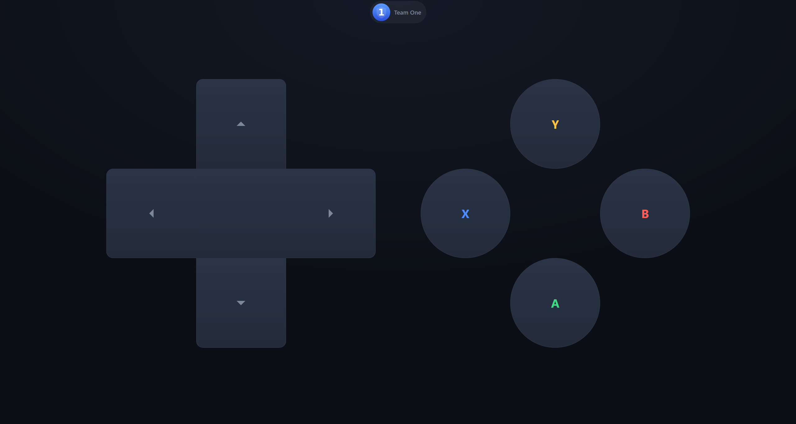
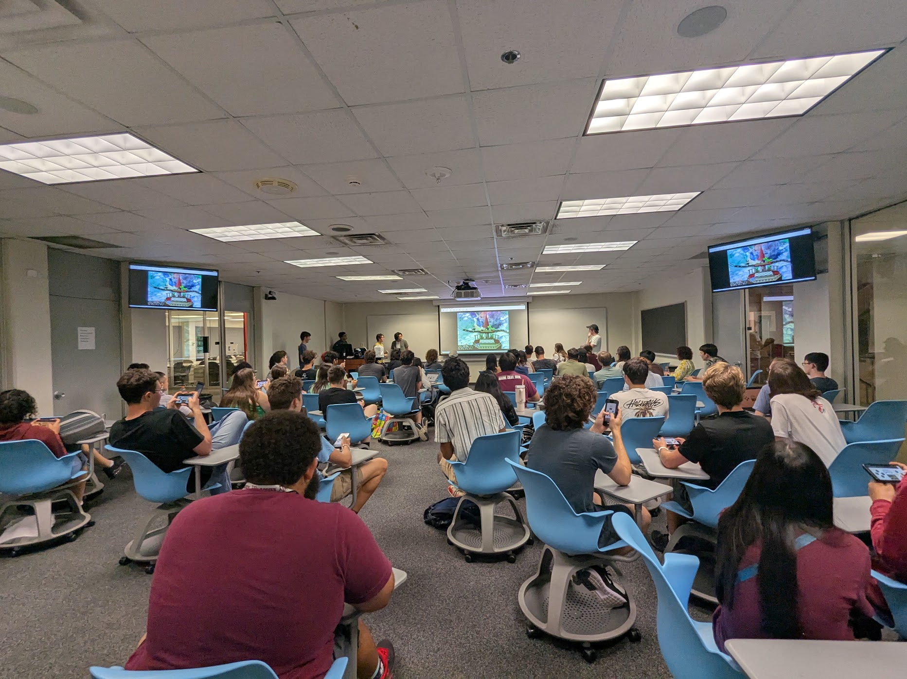

# Crowd Plays

Crowd-controlled keyboard inspired by DougDoug's Twitch Plays. Phone players pick a team, get a controller, and send button inputs. The host machine presses the most pressed buttons from each team.




## Prerequisites
Needs Node 20.11+ and Python 3.10+.

## Quick start

### Server
```bash
npm install
python3 -m venv .venv

# Windows
.venv\Scripts\pip install -r app/requirements.txt
# Linux/Mac
.venv/bin/pip install -r app/requirements.txt

npm start
```

The server prints a `trycloudflare.com` URL and writes `qr.png`. Phones open scan QR code to join.

### Host Machine
To start the key pressing on the host machine with games, run the python host file in the virtual enviornment (use the link given by the server terminal output on start):

```bash
python3 app/host.py https://….trycloudflare.com
```

### Mac Note

The URL is new every time you start the server. If you restart the server, you will need to give users the new link or QR code. 

On macOS, allow Terminal/Python under System Settings → Privacy & Security → Accessibility so `host.py` can press keys.

## Use

- **Phone Players** — Scan `qr.png`, pick a team, then use the controller.
- **Host page** — `https://….trycloudflare.com/admin.html`. Map buttons to keys, save/load layouts, pause inputs, or reset teams. It is recomended to pause inputs rather than kill the server to avoid needing to redistribute the QR code. 
- **Team images** — Replace `app/public/teams/one.png` and `two.png`.
